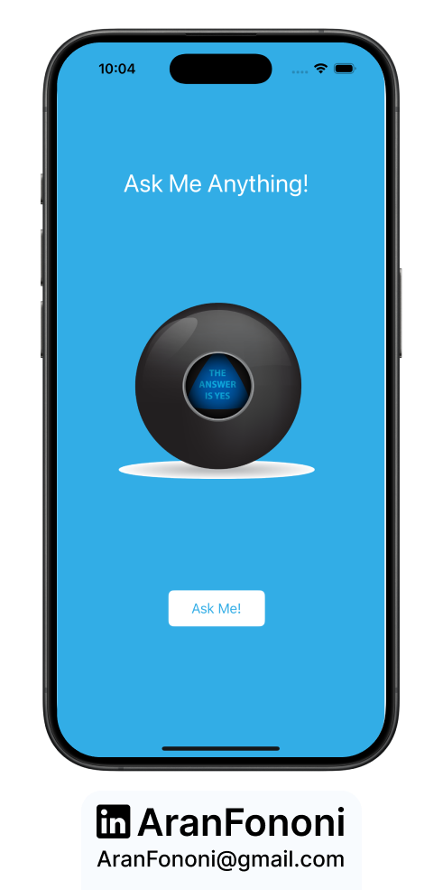
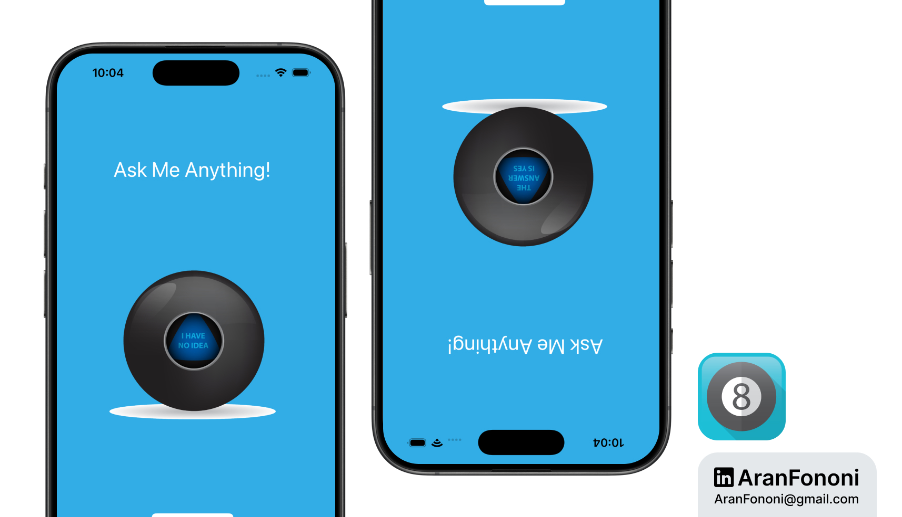

# Magic 8 Ball

### Project for Section 5: **Randomization and Basic Swift Principles**  
This project was completed as part of Section 5 in the **Complete iOS Development Bootcamp** by Angela Yu.

## Project Overview
**Magic 8 Ball** is a simple app that provides random answers to user questions, similar to the classic Magic 8 Ball toy. When the user presses the button, the app displays a random response: "Yes," "No," "Ask again later," or similar answers.

## What I Learned
In this project, I learned:
- **Randomization in Swift**: Used Swift's randomization capabilities to select a random image from an array.
- **Array Management**: Created and manipulated an array of images to represent possible responses.
- **User Interaction**: Developed a simple user interface that responds to button presses to enhance user engagement.

## Key Skills
- Randomization Techniques in Swift
- Working with Arrays
- Basic User Interaction with Buttons

---

### Project Preview

---

### Footer

---

## Contact
For more information, feel free to reach out:  
- **Email**: [aranfononi@gmail.com](mailto:aranfononi@gmail.com)  
- **LinkedIn**: [Aran Fononi](https://www.linkedin.com/in/aran-fononi-18182b265)
